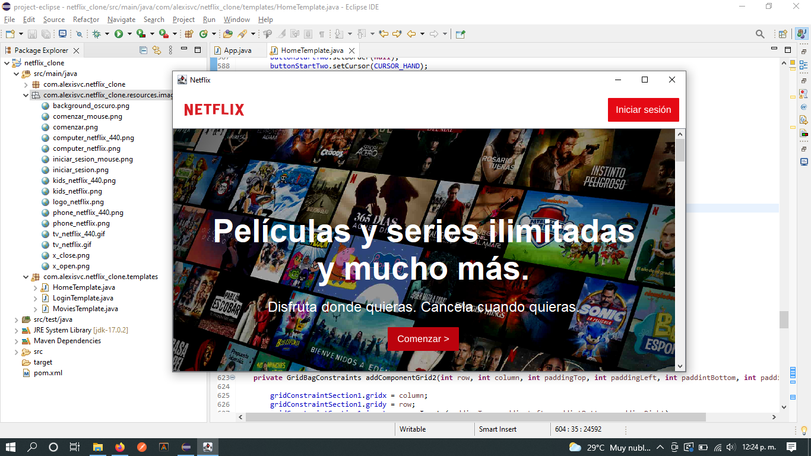
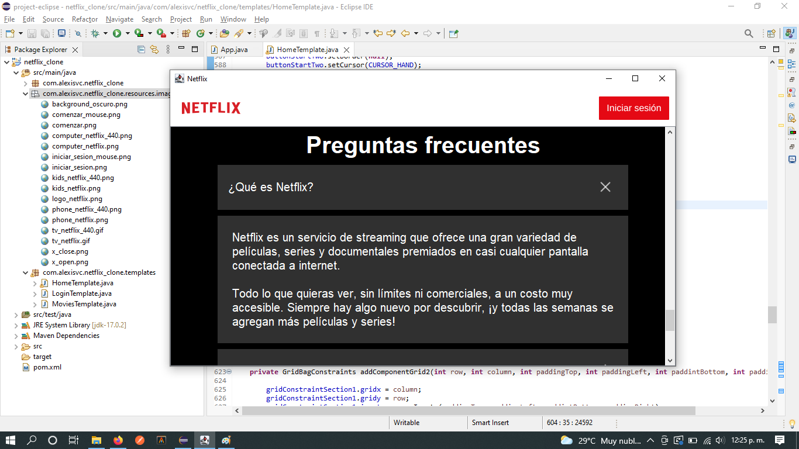
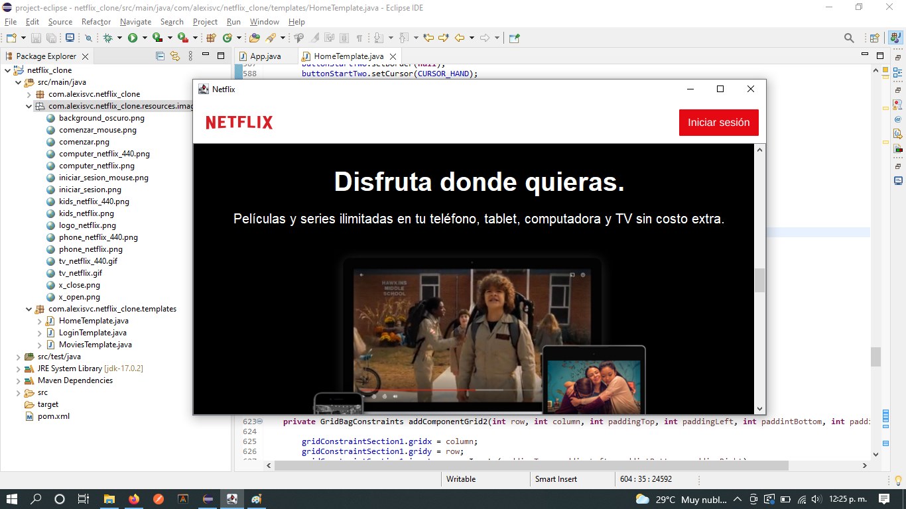
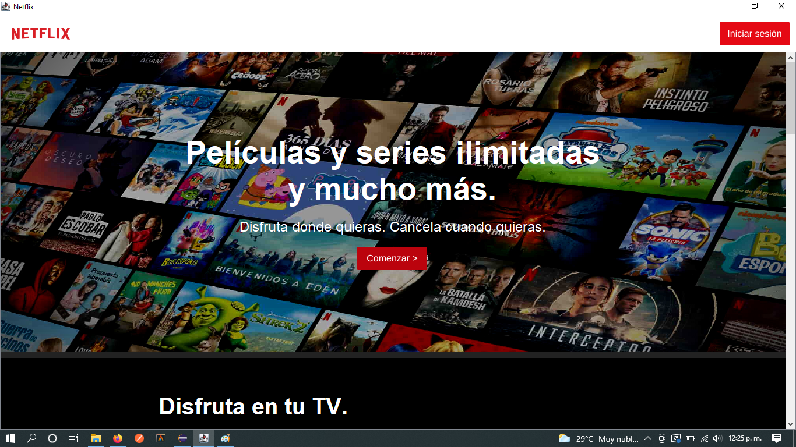
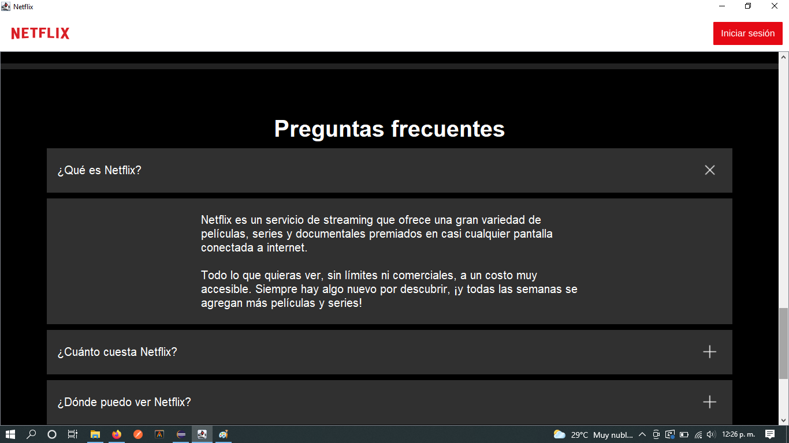

# Clone-Netflix-Java
Clone of Netflix with Java SE, this is a personal project for practice the differents layouts in Java like "GridBagLayout" or "BorderLayout".
This is a first look at home template of netflix clone app.

# View of home template

